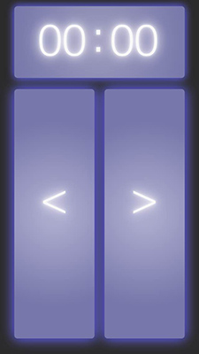

Midisentation
====
Presentation remote pager via Web MIDI API

##DESCRIPTION
Midisentation is a presentation remote pager tool.
It sends control messages to [reveal.js](http://lab.hakim.se/reveal-js/) via [Web MIDI API](http://www.w3.org/TR/webmidi/).

##FEATURES
- remote paging forward/backward
- timer display
- bluetooth pairing condition monitor

##WEBSITE
http://aikelab.net/midisentation/  
http://github.com/aike/midisentation

##SYSTEM REQUIREMENT
Midisentation requires the web browser which supports Web MIDI API. (ex. [Web MIDI Browser](http://www.taktech.org/takm/WebMIDIBrowser/Web_MIDI_Browser.html))

##CREDIT
Midisentation program is licenced under MIT License.  
Programming and GUI Design: aike  
Contact: twitter @aike1000
